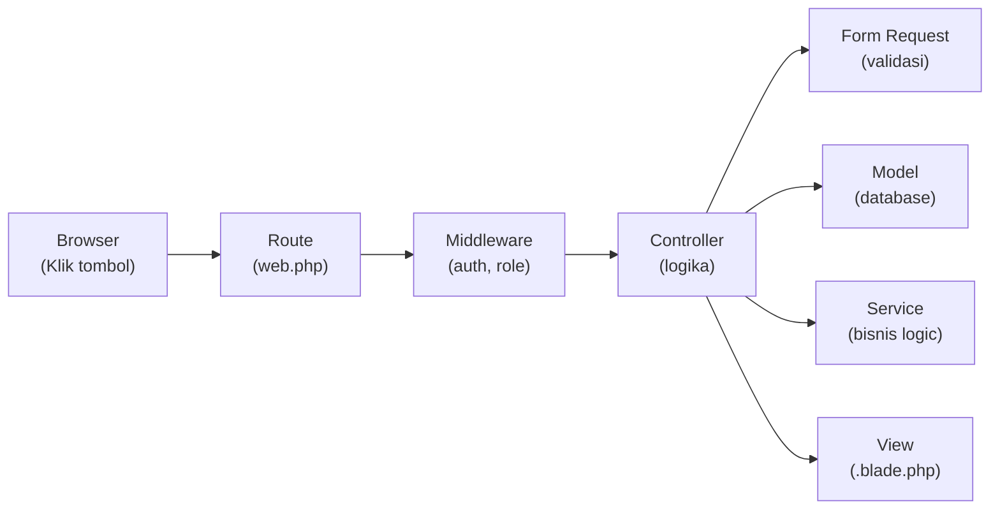

# Panduan Backend & Fungsional Admin — Kopi Ajoe

Panduan ini menjelaskan arsitektur backend, alur kerja data, dan langkah praktis untuk memodifikasi atau menambah fitur di halaman admin.

---

## 1. Arsitektur: Dari Klik Hingga Tampil

Setiap aksi pengguna di browser melewati alur berikut:



| Lapisan | File | Fungsi |
|---|---|---|
| **Route** | `routes/web.php` | Menentukan URL → Controller |
| **Middleware** | `app/Http/Middleware/RoleMiddleware.php` | Mengecek apakah user punya hak akses |
| **Controller** | `app/Http/Controllers/Admin/*.php` | Menerima request, memanggil logika, return view |
| **Form Request** | `app/Http/Requests/*.php` | Validasi input form sebelum masuk controller |
| **Model** | `app/Models/*.php` | Representasi tabel database + relasi |
| **Service** | `app/Services/*.php` | Logika bisnis kompleks (stok, gaji, transaksi) |
| **View** | `resources/views/admin/*.blade.php` | Tampilan HTML |

---

## 2. Peta File Backend Admin

```
app/
├── Http/
│   ├── Controllers/Admin/
│   │   ├── AdminController.php     ← Dashboard (statistik)
│   │   ├── UserController.php      ← CRUD Pengguna
│   │   ├── MotorController.php     ← CRUD Motor
│   │   └── MenuController.php      ← CRUD Menu
│   ├── Requests/
│   │   ├── StoreUserRequest.php    ← Validasi form "Tambah User"
│   │   ├── UpdateUserRequest.php   ← Validasi form "Edit User"
│   │   ├── StoreMotorRequest.php   ← Validasi form "Tambah Motor"
│   │   ├── UpdateMotorRequest.php  ← Validasi form "Edit Motor"
│   │   ├── StoreMenuRequest.php    ← Validasi form "Tambah Menu"
│   │   └── UpdateMenuRequest.php   ← Validasi form "Edit Menu"
│   └── Middleware/
│       └── RoleMiddleware.php      ← Proteksi berdasarkan role
├── Models/
│   ├── User.php                    ← Tabel users
│   ├── Motor.php                   ← Tabel motors
│   ├── Menu.php                    ← Tabel menus
│   ├── MenuStock.php               ← Tabel stok global menu
│   └── ...                         ← Model lainnya
├── Services/
│   ├── StockService.php            ← Logika stok
│   ├── TransactionService.php      ← Logika transaksi
│   ├── SalaryService.php           ← Logika gaji
│   ├── SellingSessionService.php   ← Logika sesi jual
│   └── NotificationService.php     ← Logika notifikasi
routes/
└── web.php                         ← Semua definisi URL
```

---

## 3. Routing: Mengatur URL

File: [web.php](file:///e:/Mata%20Kuliah/Vibe%20Coding/kopi-ajoe/routes/web.php)

### Struktur Route Admin Saat Ini

```php
Route::middleware(['auth', 'role:admin'])   // ← Harus login + role admin
    ->prefix('admin')                       // ← URL diawali /admin/...
    ->name('admin.')                        // ← Nama route diawali admin.
    ->group(function () {
        Route::get('/dashboard', [AdminController::class, 'index'])->name('dashboard');
        Route::resource('users', UserController::class);     // ← 7 route CRUD otomatis
        Route::resource('motors', MotorController::class);
        Route::resource('menus', MenuController::class);
    });
```

### Route yang Dibuat oleh `Route::resource()`

`Route::resource('users', UserController::class)` otomatis membuat **7 route**:

| HTTP Method | URL | Controller Method | Nama Route | Fungsi |
|---|---|---|---|---|
| GET | `/admin/users` | `index()` | `admin.users.index` | Daftar semua |
| GET | `/admin/users/create` | `create()` | `admin.users.create` | Form tambah |
| POST | `/admin/users` | `store()` | `admin.users.store` | Simpan baru |
| GET | `/admin/users/{user}` | `show()` | `admin.users.show` | Detail satu |
| GET | `/admin/users/{user}/edit` | `edit()` | `admin.users.edit` | Form edit |
| PUT/PATCH | `/admin/users/{user}` | `update()` | `admin.users.update` | Simpan edit |
| DELETE | `/admin/users/{user}` | `destroy()` | `admin.users.destroy` | Hapus |

### Contoh: Menambah Route Custom

```php
// Menambah route non-CRUD di dalam grup admin
Route::get('/reports', [ReportController::class, 'index'])->name('reports.index');

// Menambah route custom pada resource yang sudah ada
Route::post('/users/{user}/toggle-active', [UserController::class, 'toggleActive'])
    ->name('users.toggle-active');
```

### Contoh: Membatasi Method Resource

```php
// Hanya index, create, store, edit, update, destroy (tanpa show)
Route::resource('users', UserController::class)->except(['show']);

// Hanya index dan show
Route::resource('users', UserController::class)->only(['index', 'show']);
```

---

## 4. Controller: Tempat Logika Utama

File contoh: [UserController.php](file:///e:/Mata%20Kuliah/Vibe%20Coding/kopi-ajoe/app/Http/Controllers/Admin/UserController.php)

### Anatomi Controller

```php
class UserController extends Controller
{
    // GET /admin/users → Menampilkan daftar
    public function index()
    {
        $users = User::latest()->paginate(10);        // ← Query database
        return view('admin.users.index', compact('users'));  // ← Return view + data
    }

    // GET /admin/users/create → Menampilkan form kosong
    public function create()
    {
        return view('admin.users.create');
    }

    // POST /admin/users → Menyimpan data baru
    public function store(StoreUserRequest $request)   // ← Validasi otomatis
    {
        $data = $request->validated();                 // ← Ambil data yang lolos validasi
        $data['password'] = Hash::make($data['password']);
        User::create($data);                           // ← Simpan ke database
        return redirect()->route('admin.users.index')
            ->with('success', 'User created.');        // ← Redirect + flash message
    }

    // GET /admin/users/{user}/edit → Menampilkan form isi
    public function edit(User $user)                   // ← Route Model Binding (otomatis cari by ID)
    {
        return view('admin.users.edit', compact('user'));
    }

    // PUT /admin/users/{user} → Menyimpan perubahan
    public function update(UpdateUserRequest $request, User $user)
    {
        $data = $request->validated();
        if (!empty($data['password'])) {
            $data['password'] = Hash::make($data['password']);
        } else {
            unset($data['password']);                   // ← Jangan update jika kosong
        }
        $user->update($data);
        return redirect()->route('admin.users.index')
            ->with('success', 'User updated.');
    }

    // DELETE /admin/users/{user} → Menghapus data
    public function destroy(User $user)
    {
        if ($user->id === auth()->id()) {              // ← Validasi bisnis
            return redirect()->route('admin.users.index')
                ->withErrors(['error' => 'Cannot delete yourself.']);
        }
        $user->delete();                               // ← Soft delete (karena model pakai SoftDeletes)
        return redirect()->route('admin.users.index')
            ->with('success', 'User deleted.');
    }
}
```

### Contoh Modifikasi: Menambah Fitur Pencarian di Index

```php
public function index(Request $request)
{
    $query = User::latest();

    // Filter berdasarkan pencarian
    if ($request->filled('search')) {
        $search = $request->search;
        $query->where(function ($q) use ($search) {
            $q->where('name', 'like', "%{$search}%")
              ->orWhere('email', 'like', "%{$search}%");
        });
    }

    // Filter berdasarkan role
    if ($request->filled('role')) {
        $query->where('role', $request->role);
    }

    $users = $query->paginate(10)->withQueryString(); // ← withQueryString() agar filter bertahan saat paginasi
    return view('admin.users.index', compact('users'));
}
```

Lalu di Blade (`index.blade.php`), tambahkan form pencarian:
```html
<form method="GET" action="{{ route('admin.users.index') }}" class="flex gap-3 mb-6">
    <input type="text" name="search" value="{{ request('search') }}" placeholder="Cari nama/email..." 
           class="rounded-xl border-gray-200 ...">
    <select name="role" class="rounded-xl ...">
        <option value="">Semua Role</option>
        <option value="admin" {{ request('role') == 'admin' ? 'selected' : '' }}>Admin</option>
        <option value="manager" {{ request('role') == 'manager' ? 'selected' : '' }}>Manager</option>
        <option value="seller" {{ request('role') == 'seller' ? 'selected' : '' }}>Seller</option>
    </select>
    <button type="submit" class="bg-amber-600 text-white px-4 rounded-xl">Cari</button>
</form>
```

### Contoh Modifikasi: Menambah Method Custom

```php
// Tambahkan method baru di UserController
public function toggleActive(User $user)
{
    $user->update(['is_active' => !$user->is_active]);
    
    $status = $user->is_active ? 'diaktifkan' : 'dinonaktifkan';
    return redirect()->route('admin.users.index')
        ->with('success', "Akun {$user->name} berhasil {$status}.");
}
```

Lalu daftarkan route-nya di `web.php`:
```php
Route::post('/users/{user}/toggle-active', [UserController::class, 'toggleActive'])
    ->name('users.toggle-active');
```

Dan panggil dari Blade:
```html
<form action="{{ route('admin.users.toggle-active', $user) }}" method="POST" class="inline">
    @csrf
    <button type="submit">{{ $user->is_active ? 'Nonaktifkan' : 'Aktifkan' }}</button>
</form>
```

---

## 5. Form Request: Validasi Input

File contoh: [StoreUserRequest.php](file:///e:/Mata%20Kuliah/Vibe%20Coding/kopi-ajoe/app/Http/Requests/StoreUserRequest.php)

### Anatomi Form Request

```php
class StoreUserRequest extends FormRequest
{
    // Siapa yang boleh submit form ini?
    public function authorize(): bool
    {
        return auth()->user()->isAdmin();    // ← Hanya Admin
    }

    // Aturan validasi per-field
    public function rules(): array
    {
        return [
            'name'            => ['required', 'string', 'max:255'],
            'email'           => ['required', 'email', 'unique:users'],
            'password'        => ['required', 'confirmed', Password::defaults()],
            'role'            => ['required', 'in:admin,manager,seller'],
            'is_active'       => ['boolean'],
            'base_salary'     => ['nullable', 'numeric', 'min:0'],
            'commission_rate' => ['nullable', 'numeric', 'min:0', 'max:100'],
        ];
    }
}
```

### Aturan Validasi Umum

| Rule | Arti | Contoh |
|---|---|---|
| `required` | Wajib diisi | `'name' => ['required']` |
| `nullable` | Boleh kosong | `'phone' => ['nullable']` |
| `string` | Harus teks | |
| `numeric` | Harus angka | |
| `email` | Format email valid | |
| `max:255` | Maksimal 255 karakter | |
| `min:0` | Minimal nilai 0 | |
| `in:a,b,c` | Harus salah satu dari a, b, atau c | `'role' => ['in:admin,manager,seller']` |
| `unique:table` | Tidak boleh duplikat di tabel | `'email' => ['unique:users']` |
| `confirmed` | Harus ada field `xxx_confirmation` | `'password' => ['confirmed']` |
| `boolean` | Harus true/false (1/0) | |
| `image` | Harus file gambar | |
| `mimes:jpg,png` | Format file tertentu | |
| `max:2048` | Maks ukuran file 2MB | |

### Contoh: Menambah Field Validasi Baru

Jika Anda menambahkan kolom `phone` ke form user:

1. **Tambah rule di** `StoreUserRequest.php`:
   ```php
   'phone' => ['nullable', 'string', 'max:20', 'regex:/^[0-9+\-\s]+$/'],
   ```

2. **Tambah ke `$fillable` di** `User.php` (jika belum ada):
   ```php
   protected $fillable = [
       'name', 'email', 'password', 'role', 'phone', ...
   ];
   ```

3. **Tambah input di** `create.blade.php`:
   ```html
   <div>
       <label for="phone">No. Telepon</label>
       <input type="text" name="phone" id="phone" value="{{ old('phone') }}">
       @error('phone') <p class="text-red-600">{{ $message }}</p> @enderror
   </div>
   ```

### Contoh: Menambah Pesan Error Kustom

```php
public function messages(): array
{
    return [
        'name.required' => 'Nama wajib diisi.',
        'email.unique' => 'Email ini sudah terdaftar di sistem.',
        'password.confirmed' => 'Konfirmasi password tidak cocok.',
    ];
}
```

---

## 6. Model: Database & Relasi

File contoh: [User.php](file:///e:/Mata%20Kuliah/Vibe%20Coding/kopi-ajoe/app/Models/User.php)

### Anatomi Model

```php
class User extends Authenticatable
{
    use HasFactory, Notifiable, SoftDeletes;  // ← SoftDeletes = data tidak benar-benar terhapus

    // Kolom yang boleh diisi massal (mass assignment)
    protected $fillable = [
        'name', 'email', 'password', 'role', 'phone', 'address',
        'base_salary', 'commission_rate', 'is_active', 'profile_photo',
    ];

    // Kolom yang disembunyikan dari JSON response
    protected $hidden = ['password', 'remember_token'];

    // Tipe data casting otomatis
    protected function casts(): array
    {
        return [
            'is_active'    => 'boolean',       // ← otomatis jadi true/false
            'base_salary'  => 'decimal:2',     // ← otomatis 2 desimal
        ];
    }

    // --- Relasi ---
    public function sellingSessions() { return $this->hasMany(SellingSession::class, 'seller_id'); }
    
    // --- Helper ---
    public function isAdmin(): bool { return $this->role === 'admin'; }
}
```

### Operasi Database Umum

```php
// Ambil semua data, urutkan terbaru
$users = User::latest()->get();

// Ambil dengan paginasi (10 per halaman)
$users = User::paginate(10);

// Filter
$sellers = User::where('role', 'seller')->where('is_active', true)->get();

// Cari by ID
$user = User::find(1);
$user = User::findOrFail(1);  // ← Error 404 jika tidak ditemukan

// Buat baru
User::create(['name' => 'John', 'email' => 'john@test.com', ...]);

// Update
$user->update(['name' => 'Jane']);

// Hapus (soft delete)
$user->delete();

// Hitung
$total = User::count();
$totalSellers = User::where('role', 'seller')->count();

// Agregasi
$totalSales = Transaction::whereDate('created_at', today())->sum('total_amount');
```

### Contoh: Menambah Kolom Baru ke Database

Jika Anda ingin menambahkan kolom `phone` ke tabel `users`:

**Langkah 1:** Buat migration
```bash
php artisan make:migration add_phone_to_users_table --table=users
```

**Langkah 2:** Edit migration yang dibuat di `database/migrations/`
```php
public function up(): void
{
    Schema::table('users', function (Blueprint $table) {
        $table->string('phone', 20)->nullable()->after('email');
    });
}

public function down(): void
{
    Schema::table('users', function (Blueprint $table) {
        $table->dropColumn('phone');
    });
}
```

**Langkah 3:** Jalankan migration
```bash
php artisan migrate
```

**Langkah 4:** Tambahkan ke `$fillable` di Model
```php
protected $fillable = ['name', 'email', 'phone', ...];
```

---

## 7. Dashboard: Mengubah Statistik

File: [AdminController.php](file:///e:/Mata%20Kuliah/Vibe%20Coding/kopi-ajoe/app/Http/Controllers/Admin/AdminController.php)

### Menambah Statistik Baru

```php
public function index()
{
    $stats = [
        'total_users'    => User::count(),
        'active_sellers' => User::where('role', 'seller')->where('is_active', true)->count(),
        'total_motors'   => Motor::count(),
        'total_menus'    => Menu::count(),
        'today_sales'    => Transaction::whereDate('created_at', today())->sum('total_amount'),

        // ← TAMBAHKAN STATISTIK BARU DI SINI
        'motors_available' => Motor::where('status', 'available')->count(),
        'menus_active'     => Menu::where('is_active', true)->count(),
        'this_month_sales' => Transaction::whereMonth('created_at', now()->month)
                                ->whereYear('created_at', now()->year)
                                ->sum('total_amount'),
    ];

    return view('admin.dashboard', compact('stats'));
}
```

Lalu di `dashboard.blade.php`, akses dengan `{{ $stats['motors_available'] }}`.

### Mengirim Data untuk Grafik (Mengganti Placeholder)

```php
public function index()
{
    $stats = [ /* ... */ ];

    // Data 7 hari terakhir untuk grafik penjualan
    $salesChart = [];
    for ($i = 6; $i >= 0; $i--) {
        $date = now()->subDays($i);
        $salesChart[] = [
            'label' => $date->translatedFormat('D'),   // Sen, Sel, Rab...
            'value' => Transaction::whereDate('created_at', $date)->sum('total_amount'),
        ];
    }

    return view('admin.dashboard', compact('stats', 'salesChart'));
}
```

Di Blade, gunakan data asli:
```html
<script>
    const salesData = @json($salesChart);
    // Lalu gunakan salesData.map(d => d.label) untuk labels
    // dan salesData.map(d => d.value) untuk data
</script>
```

---

## 8. Membuat Modul CRUD Baru dari Nol

Contoh: menambahkan CRUD untuk entitas **Supplier**.

### Langkah 1: Buat Migration & Model

```bash
php artisan make:model Supplier -m
```

Edit migration (`database/migrations/xxxx_create_suppliers_table.php`):
```php
Schema::create('suppliers', function (Blueprint $table) {
    $table->id();
    $table->string('name');
    $table->string('contact');
    $table->text('address')->nullable();
    $table->boolean('is_active')->default(true);
    $table->timestamps();
    $table->softDeletes();
});
```

Edit model (`app/Models/Supplier.php`):
```php
class Supplier extends Model
{
    use HasFactory, SoftDeletes;
    
    protected $fillable = ['name', 'contact', 'address', 'is_active'];
    protected $casts = ['is_active' => 'boolean'];
}
```

### Langkah 2: Buat Controller & Form Requests

```bash
php artisan make:controller Admin/SupplierController --resource
php artisan make:request StoreSupplierRequest
php artisan make:request UpdateSupplierRequest
```

### Langkah 3: Daftarkan Route

Tambahkan di `routes/web.php` dalam grup admin:
```php
Route::resource('suppliers', \App\Http\Controllers\Admin\SupplierController::class);
```

### Langkah 4: Buat Views

Buat folder `resources/views/admin/suppliers/` dan isi dengan:
- `index.blade.php` — Salin dari `admin/users/index.blade.php`, ubah variabel
- `create.blade.php` — Salin dari `admin/users/create.blade.php`, ubah field
- `edit.blade.php` — Salin dari `admin/users/edit.blade.php`, ubah field

### Langkah 5: Tambah Link di Sidebar

Edit `resources/views/layouts/admin.blade.php`, tambah di bagian `<nav>`:
```html
<x-sidebar-link :href="route('admin.suppliers.index')" :active="request()->routeIs('admin.suppliers.*')">
    <svg class="w-5 h-5 mr-3" ...><!-- ikon SVG --></svg>
    Supplier
</x-sidebar-link>
```

### Langkah 6: Jalankan Migration

```bash
php artisan migrate
```

---

## 9. Middleware: Proteksi Akses

File: [RoleMiddleware.php](file:///e:/Mata%20Kuliah/Vibe%20Coding/kopi-ajoe/app/Http/Middleware/RoleMiddleware.php)

### Cara Kerjanya

```php
class RoleMiddleware
{
    public function handle(Request $request, Closure $next, string $role): Response
    {
        // Jika user tidak login ATAU role-nya tidak sesuai → 403 Forbidden
        if (! $request->user() || $request->user()->role !== $role) {
            abort(403, 'Unauthorized access.');
        }
        return $next($request);   // ← Lanjut ke controller
    }
}
```

Middleware ini dipanggil di route: `Route::middleware(['auth', 'role:admin'])`.

### Contoh: Membuat Role Ganda

Jika Anda ingin satu route bisa diakses oleh admin DAN manager:
```php
// Ubah RoleMiddleware agar mendukung banyak role
public function handle(Request $request, Closure $next, string ...$roles): Response
{
    if (! $request->user() || ! in_array($request->user()->role, $roles)) {
        abort(403, 'Unauthorized access.');
    }
    return $next($request);
}
```

Lalu di route:
```php
Route::middleware(['auth', 'role:admin,manager'])->group(function () {
    // Route yang bisa diakses admin DAN manager
});
```

---

## 10. Service Layer: Logika Bisnis

File ada di `app/Services/`. Services digunakan untuk logika yang **lebih kompleks dari sekadar CRUD** — contoh: menghitung gaji, mengatur stok, dsb.

### Cara Menggunakan Service di Controller

```php
use App\Services\StockService;

class MenuController extends Controller
{
    public function store(StoreMenuRequest $request)
    {
        $menu = Menu::create($request->validated());
        
        // Panggil service untuk logika stok
        app(StockService::class)->initializeStock($menu);
        
        return redirect()->route('admin.menus.index')->with('success', 'Menu created.');
    }
}
```

### Daftar Service yang Tersedia

| Service | Fungsi |
|---|---|
| `StockService` | Pengelolaan stok pusat & sesi |
| `TransactionService` | Pembuatan & kalkulasi transaksi |
| `SalaryService` | Perhitungan gaji & komisi seller |
| `SellingSessionService` | Buka/tutup sesi jual |
| `NotificationService` | Kirim notifikasi ke user |

---

## 11. Perintah Artisan yang Berguna

```bash
# Membuat file baru
php artisan make:controller Admin/NamaController --resource   # Controller CRUD
php artisan make:model NamaModel -m                           # Model + migration
php artisan make:request NamaRequest                          # Form Request
php artisan make:migration nama_migration --table=nama_tabel  # Migration saja

# Database
php artisan migrate                  # Jalankan migration baru
php artisan migrate:rollback         # Undo migration terakhir
php artisan migrate:fresh --seed     # Reset DB + jalankan seeder (⚠️ HAPUS SEMUA DATA)

# Debugging
php artisan route:list               # Lihat semua route
php artisan route:list --path=admin  # Filter route admin saja
php artisan tinker                   # PHP shell interaktif untuk test query

# Cache
php artisan cache:clear              # Bersihkan cache
php artisan config:clear             # Bersihkan cache config
php artisan view:clear               # Bersihkan cache view (jika tampilan tidak update)
```

---

## 12. Referensi Cepat: "Saya Ingin..."

| Saya ingin... | Yang perlu diubah |
|---|---|
| Menambah kolom di tabel DB | Buat migration baru → tambah ke `$fillable` model → tambah validasi di FormRequest → tambah input di Blade |
| Menambah filter/pencarian | Edit method `index()` di Controller → tambah form di Blade |
| Menambah tombol aksi baru | Tambah route di `web.php` → tambah method di Controller → tambah tombol/form di Blade |
| Mengubah aturan validasi | Edit file `StoreXxxRequest.php` atau `UpdateXxxRequest.php` |
| Menambah relasi antar tabel | Tambah method relasi di Model → buat migration foreign key |
| Membuat modul CRUD baru | Ikuti §8 (Model → Controller → Route → Views → Sidebar) |
| Mengubah hak akses halaman | Ubah middleware di `web.php` atau `authorize()` di FormRequest |
| Mengubah data statistik dashboard | Edit `AdminController@index` |
| Mengubah jumlah item per halaman | Ubah angka di `->paginate(10)` menjadi angka lain |
| Menambah pesan flash sukses/error | Gunakan `->with('success', '...')` atau `->withErrors([...])` di Controller |

> [!TIP]
> Selalu jalankan `php artisan route:list --path=admin` setelah mengubah routes untuk memastikan route terdaftar dengan benar.

> [!WARNING]
> Jangan lupa menambahkan kolom baru ke `$fillable` di Model! Tanpa ini, `create()` dan `update()` akan mengabaikan field tersebut secara diam-diam (mass assignment protection).
